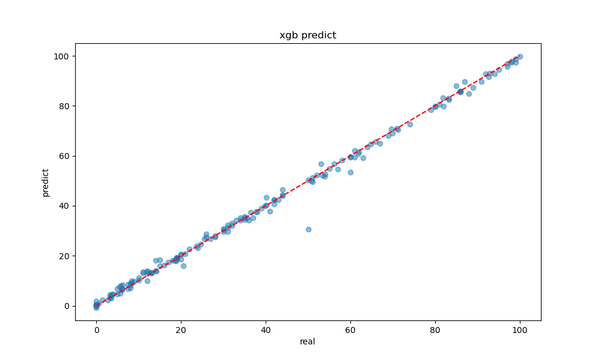
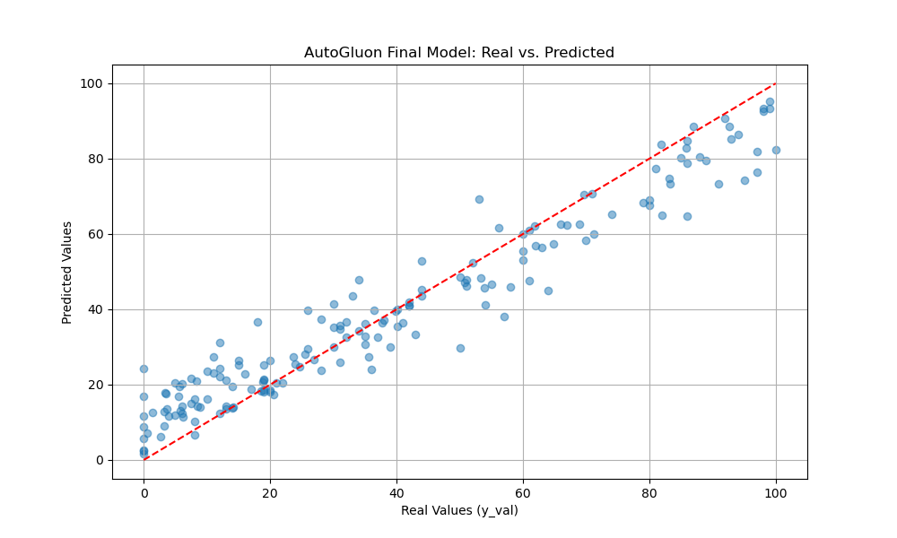
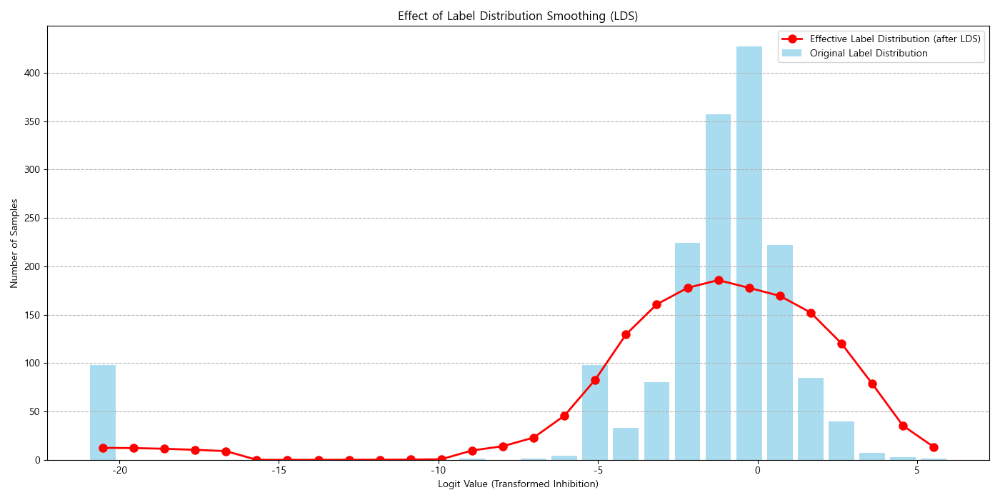
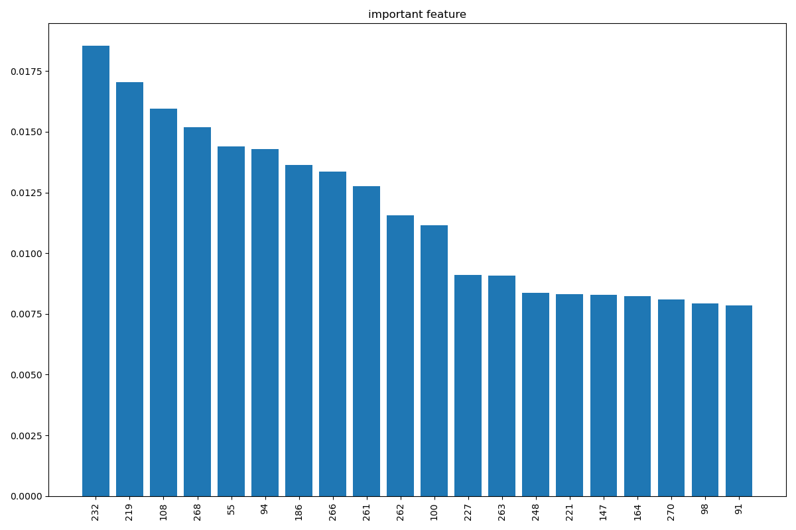

# Drug Discovery Prediction

AI 신약개발 경진대회 데이터를 바탕으로 분자 구조 기반 약물 활성 예측을 실험한 프로젝트입니다. RDKit 분자 특징, 그래프 신경망, ChemBERTa, MolCLR representation, tabular ensemble 모델을 비교하며 IC50/저해율 예측 성능을 개선하는 과정을 정리했습니다.

## Overview

이 저장소는 여러 실험을 한 번에 실행하는 완성형 패키지라기보다, 약물 예측 모델링을 위한 실험 코드와 재현 가능한 notebook archive에 가깝습니다. 데이터와 학습된 모델은 포함하지 않고, 공개 가능한 코드와 결과 이미지 중심으로 구성했습니다.

## Tech Stack

- Python
- RDKit
- PyTorch / PyTorch Geometric
- XGBoost / LightGBM / CatBoost
- AutoGluon
- ChemBERTa / MolCLR
- pandas / NumPy / scikit-learn
- Jupyter Notebook

## Main Approaches

- RDKit 기반 molecular descriptor / fingerprint 추출
- XGBoost, LightGBM, CatBoost 기반 tabular regression
- Graph Neural Network 기반 분자 그래프 회귀
- ChemBERTa fine-tuning 기반 SMILES representation 활용
- MolCLR encoder와 descriptor/fingerprint feature 결합
- FDS/LDS 기반 불균형 회귀 보정 실험

## Results / Highlights

- XGBoost baseline, AutoGluon ensemble, ChemBERTa transfer learning, MolCLR 기반 실험을 비교 가능한 코드와 노트북으로 정리했습니다.
- 대표 예측 산점도에서 XGBoost/AutoGluon 예측 결과와 실제값의 정렬 상태를 시각화했습니다.
- FDS/LDS 실험을 통해 불균형 회귀 문제에서 feature/label distribution smoothing 효과를 별도 이미지로 기록했습니다.
- 분자 descriptor 중요도와 tabular 모델 feature importance를 이미지로 남겨 모델 해석 가능성을 확보했습니다.

| XGBoost prediction | AutoGluon final model |
| --- | --- |
|  |  |

| LDS effect | Feature importance |
| --- | --- |
|  |  |

## Repository Structure

```text
.
├── assets/                  # Result figures and model-performance images
├── docs/                    # Notes and third-party notices
├── notebooks/               # Cleaned experiment notebooks
│   ├── chemberta_finetuning.ipynb
│   ├── fingerprint_descriptor_baseline.ipynb
│   ├── gnn_regression.ipynb
│   ├── legacy_transformer_finetuning.ipynb
│   └── molclr_fds_experiment.ipynb
├── src/
│   ├── molclr/              # MolCLR training/fine-tuning code used in experiments
│   ├── my_metrics.py
│   ├── my_scorers.py
│   ├── prediction_pipeline.py
│   ├── transfer_model.py
│   └── xgboost_baseline.py
├── environment.yml
├── requirements.txt
└── README.md
```

## Data

Competition data is not included. Place local data under `data/` before running scripts or notebooks.

Recommended local layout:

```text
data/
├── train.csv
├── test.csv
├── sample_submission.csv
├── ChEMBL_ASK1(IC50).csv
├── Pubchem_ASK1.csv
└── CAS_KPBMA_MAP3K5_IC50s.xlsx
```

Generated artifacts such as submission files, checkpoints, model weights, cached datasets, and AutoGluon/CatBoost outputs are ignored by Git.

## Installation

Basic environment:

```bash
pip install -r requirements.txt
```

Conda environment:

```bash
conda env create -f environment.yml
conda activate molclr
```

PyTorch Geometric may require a wheel that matches your local PyTorch and CUDA version. Install it according to the official PyTorch Geometric guide if the default installation fails.

## Usage

Run the XGBoost baseline:

```bash
python src/xgboost_baseline.py
```

Run the prediction pipeline:

```bash
python src/prediction_pipeline.py
```

Run MolCLR pretraining or fine-tuning:

```bash
cd src/molclr
python molclr.py
python finetune.py
```

Open experiment notebooks:

```bash
jupyter notebook notebooks
```

## Result Artifacts

Representative result figures are stored in `assets/`.

```text
assets/
├── feature_importance.png
├── model_performance.png
├── model_performance_transfer.png
├── fds_effect_visualization.png
├── lds_effect_visualization.png
└── autogluon_model_performance.png
```

## Third-Party Code

The MolCLR implementation used in `src/molclr` is based on the public MolCLR project for molecular contrastive representation learning. See `docs/THIRD_PARTY_NOTICES.md` and `src/molclr/LICENSE`.

## Lessons / Improvements

- 분자 예측 문제에서는 single model보다 descriptor, fingerprint, graph representation, language-model representation을 함께 비교하는 실험 설계가 중요했습니다.
- 결과 이미지와 submission 후보가 많아지면서 실험 추적 비용이 커졌고, 향후에는 MLflow/W&B 또는 JSON 기반 experiment log를 붙이는 것이 좋습니다.
- 공개 저장소에서는 데이터와 checkpoint를 제외하되, feature 생성 코드와 결과 시각화를 남기는 방식이 포트폴리오 전달력에 유리했습니다.
