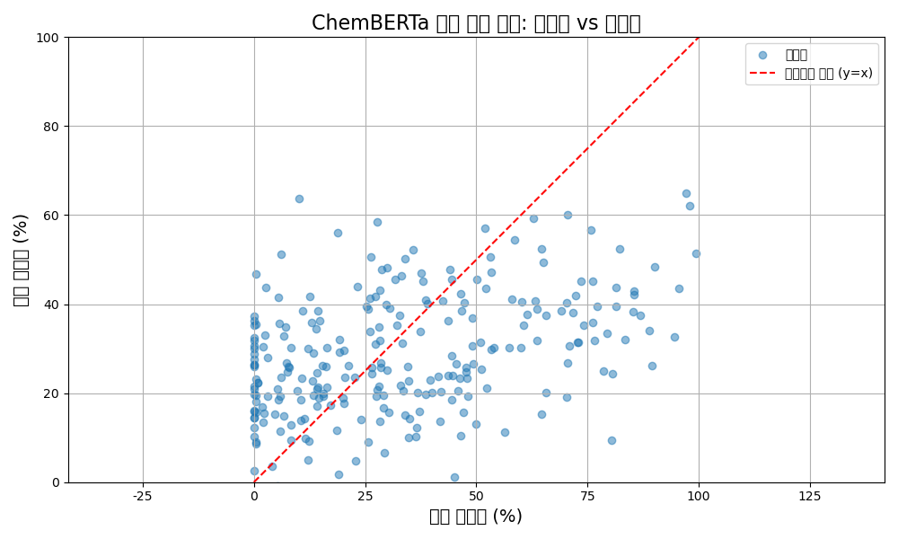
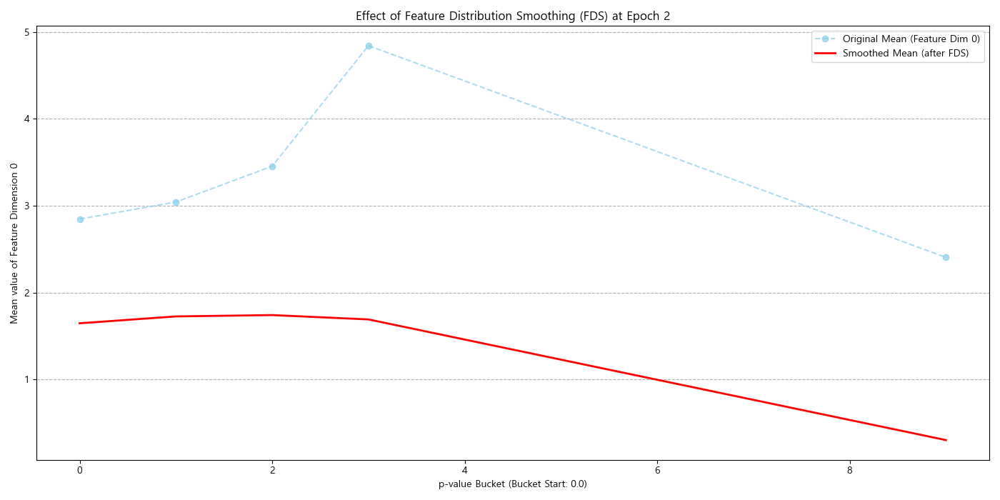

# Drug Discovery Prediction

Molecular activity prediction project for estimating drug-response values from SMILES strings and molecular descriptors. The repository is prepared as a public, portfolio-ready version of the original experiment workspace: private datasets, generated submissions, logs, and trained model artifacts are excluded, while reproducible experiment code, cleaned notebooks, and result figures are retained.

## Project Overview

This project explores how to improve molecular prediction performance by combining classical cheminformatics features with modern representation learning. The original task used molecular SMILES strings and target values such as `pIC50` or inhibition rate. The modeling work compares fingerprint-based XGBoost baselines, ChemBERTa/RoBERTa-style transfer learning, graph neural network experiments, MolCLR representation learning, and AutoGluon-style tabular ensembling.

The main goal was not only to train a single model, but to understand which representation strategy produced stable predictions and how smoothing or feature engineering could reduce errors in sparse target regions.

## Tech Stack

- Python, Jupyter Notebook
- pandas, NumPy, scikit-learn
- RDKit for molecular fingerprints and descriptors
- XGBoost, LightGBM, CatBoost, AutoGluon
- PyTorch, PyTorch Geometric
- Hugging Face Transformers, ChemBERTa/RoBERTa-style SMILES encoders
- MolCLR for molecular contrastive representation learning
- Matplotlib and Seaborn for result visualization

## Source Workspace Audit

The public repository was rechecked against the original local drug-prediction workspace.

| Original item | Public repository item | Decision |
| --- | --- | --- |
| `xgboost_0722.py` | `src/xgboost_baseline.py` | Kept as a sanitized script using `data/` and `outputs/` paths. |
| `submission.py` | `src/prediction_pipeline.py` | Kept as a sanitized inference/submission pipeline. |
| `fine_tuning.ipynb` | `notebooks/legacy_transformer_finetuning.ipynb` | Kept with notebook outputs cleared. |
| `roberta_0818.ipynb` | Not copied | Excluded because the source file is 0 bytes. |
| `Untitled.ipynb` | Not copied | Excluded because the notebook has no cells. |
| `xgboost_0722.zip`, `submission.zip` | Not copied | Excluded because they only duplicate the Python scripts. |
| `open/*.csv`, `xgboost_*.csv`, logs, local outputs | Not copied | Excluded as private data, generated submissions, logs, or reproducibility artifacts. |

More details are documented in `docs/SOURCE_AUDIT.md`.

## Modeling Goals

- Convert SMILES strings into machine-learning-ready molecular representations.
- Compare fingerprint/descriptor models against neural molecular encoders.
- Improve validation stability through cross-validation and ensemble-style modeling.
- Investigate target imbalance and sparse-label regions with LDS/FDS smoothing.
- Keep the public repository lightweight by excluding raw datasets, trained weights, and submission files.

## Performance Improvement Process

### 1. Fingerprint baseline

The first baseline used RDKit Morgan fingerprints and XGBoost regression. This created a fast benchmark that made it easy to validate the data split, scoring function, and prediction range before adding heavier neural models.

Key idea: start with a strong, interpretable cheminformatics baseline instead of immediately fine-tuning a transformer.

### 2. Similarity and autoencoder features

The original `xgboost_0722.py` experiment generated Morgan fingerprints, built a molecular similarity matrix, compressed the representation with an autoencoder, and searched XGBoost hyperparameters with K-fold validation. This was intended to reduce high-dimensional fingerprint noise while preserving molecular similarity information.

Public script: `src/xgboost_baseline.py`

### 3. Larger fingerprint inference pipeline

The `submission.py` workflow used a larger Morgan fingerprint size and a fixed XGBoost configuration to generate test predictions. The public version writes generated files under `outputs/`, which is ignored by Git.

Public script: `src/prediction_pipeline.py`

### 4. Transformer-based SMILES representation

The fine-tuning notebook used a pretrained SMILES tokenizer/model (`seyonec/PubChem10M_SMILES_BPE_450k`) and attached a regression head for `pIC50` prediction. Additional ChemBERTa experiments explored pretrained chemical language models and combined their embeddings with RDKit descriptors.

Public notebooks:

- `notebooks/legacy_transformer_finetuning.ipynb`
- `notebooks/chemberta_finetuning.ipynb`

### 5. Graph and MolCLR experiments

Graph neural network and MolCLR experiments converted molecules into graph structures, extracted graph-level embeddings, and tested whether graph representations improved prediction quality beyond tabular fingerprints.

Public notebooks and code:

- `notebooks/gnn_regression.ipynb`
- `notebooks/molclr_fds_experiment.ipynb`
- `src/molclr/`

### 6. Distribution smoothing and ensemble modeling

Because molecular activity datasets often have uneven target distributions, LDS and FDS experiments were used to inspect whether label/feature smoothing could make training less biased toward dense value ranges. AutoGluon and tree-based ensembles were also tested as a practical way to combine engineered molecular features.

## Results and Artifacts

The figures below are arranged vertically so that each result can be read as a separate experiment note.

### XGBoost baseline prediction


This scatter plot compares actual values with XGBoost predictions. The diagonal reference line represents ideal prediction. The baseline shows that fingerprint-based tree models can already capture a meaningful relationship between molecular structure and the target value, making it a useful benchmark for later neural approaches.

### AutoGluon ensemble prediction


AutoGluon-style tabular ensembling was tested after feature engineering. The figure records the final real-vs-predicted relationship and was used to compare whether automated model selection and stacking produced a more stable prediction pattern than a single hand-tuned model.

### ChemBERTa transfer-learning result



The transfer-learning experiment fine-tuned a pretrained chemical language model for regression. Compared with the tree-based baseline, this experiment was useful for checking whether SMILES language-model embeddings improved generalization. The result also showed that pretrained transformers may require careful data size control, regularization, and validation design to outperform descriptor-based models.

### Label Distribution Smoothing


LDS was used to smooth the target-label distribution. The visualized smoothed curve makes sparse target intervals easier to identify and provides a basis for reweighting loss values during training.

### Feature Distribution Smoothing



FDS was used to inspect whether feature statistics changed smoothly across target ranges. This is especially relevant for molecular regression because compounds in rare activity ranges can be underrepresented and may produce unstable feature distributions.

### Feature importance


Feature importance analysis was used to interpret which engineered molecular descriptors or fingerprint-derived features contributed most to prediction. This helped connect model behavior back to molecular feature engineering rather than treating the model as a black box.

## Repository Structure

```text
.
|-- assets/
|   |-- autogluon_model_performance.png
|   |-- fds_effect_visualization.png
|   |-- feature_importance.png
|   |-- lds_effect_visualization.png
|   |-- model_performance.png
|   `-- model_performance_transfer.png
|-- docs/
|   |-- DATA.md
|   |-- SOURCE_AUDIT.md
|   `-- THIRD_PARTY_NOTICES.md
|-- notebooks/
|   |-- chemberta_finetuning.ipynb
|   |-- fingerprint_descriptor_baseline.ipynb
|   |-- gnn_regression.ipynb
|   |-- legacy_transformer_finetuning.ipynb
|   `-- molclr_fds_experiment.ipynb
|-- src/
|   |-- molclr/
|   |-- my_metrics.py
|   |-- my_scorers.py
|   |-- prediction_pipeline.py
|   |-- transfer_model.py
|   `-- xgboost_baseline.py
|-- environment.yml
|-- requirements.txt
`-- README.md
```

## Data Policy

Raw datasets and generated artifacts are intentionally not included.

Expected local layout:

```text
data/
|-- train.csv
|-- test.csv
|-- sample_submission.csv
|-- ChEMBL_ASK1(IC50).csv
|-- Pubchem_ASK1.csv
`-- CAS_KPBMA_MAP3K5_IC50s.xlsx
```

The following are excluded from version control:

- raw competition data
- submission CSV files
- TensorBoard logs
- trained checkpoints and model weights
- AutoGluon/CatBoost output directories
- cached feature matrices and compressed archives

## Installation

Basic Python environment:

```bash
pip install -r requirements.txt
```

Conda environment:

```bash
conda env create -f environment.yml
conda activate autogluon
```

PyTorch Geometric may require a wheel matching the local PyTorch and CUDA version.

## Usage

Place private data under `data/` first.

Run the XGBoost autoencoder baseline:

```bash
python src/xgboost_baseline.py
```

Run the public inference/submission pipeline:

```bash
python src/prediction_pipeline.py
```

Run ChemBERTa transfer-learning script:

```bash
python src/transfer_model.py
```

Open notebooks:

```bash
jupyter notebook notebooks
```

Run MolCLR code:

```bash
cd src/molclr
python molclr.py
python finetune.py
```

## Key Outputs

- Real-vs-predicted plots for XGBoost, AutoGluon, and ChemBERTa experiments
- LDS/FDS visualization for distribution smoothing analysis
- Feature-importance figure for model interpretation
- Cleaned notebooks that preserve the main experiment flow without private outputs
- Sanitized scripts that write generated files to ignored `outputs/` paths

## Conclusion

The experiments suggest that descriptor/fingerprint-based tree models are a strong and practical baseline for this molecular prediction task. Transformer and graph-based approaches add useful representation-learning options, but they require careful validation, regularization, and enough data to consistently outperform engineered molecular features. Distribution smoothing experiments helped clarify why rare target ranges can be difficult to predict and gave a concrete direction for improving robustness.

For a production-grade follow-up, the next improvements would be to add a unified experiment logger, store cross-validation metrics in machine-readable files, track feature-generation versions, and evaluate the final model on an external molecular dataset.

## Lessons Learned

- Molecular prediction performance depends heavily on representation quality, not only model choice.
- RDKit fingerprints and descriptors provide a reliable baseline that should be measured before adding complex neural models.
- SMILES transformers can be powerful, but fine-tuning stability depends on dataset size, target scaling, and validation design.
- LDS/FDS-style analysis is useful when the target distribution is imbalanced or sparse.
- Public ML repositories should separate reproducible code from private data, generated submissions, and trained artifacts.

## Third-Party Notice

The MolCLR implementation under `src/molclr` is based on the public MolCLR project for molecular contrastive representation learning. See `docs/THIRD_PARTY_NOTICES.md` and `src/molclr/LICENSE`.
